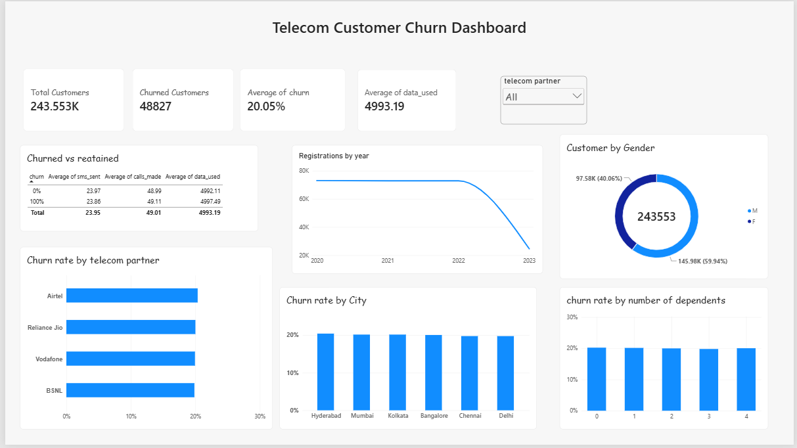

# Telecom Customer Churn Analysis

Analysis of 243,553 telecom customers using **SQL** and **Power BI** to find what drives churn.

## Dataset
- 243,553 customers, 14 columns (partner, age, gender, city, salary, calls, SMS, data used, registration date, churn)
- Period: Jan 2020 to 4 May 2023
- Target: `churn` (1 = left, 0 = stayed)

## Key findings
- Overall churn rate is **20.05%** (48,827 customers).
- Churn is about 20% for every telecom partner, age group, salary band, city and household size.
- Churned and retained customers use calls, SMS and data equally.
- Registrations are steady at about 200 per day, with no seasonal trend.

## Data issues
- 19,587 rows (about 8%) have negative usage values, which were excluded from usage averages.
- State and city values do not match (for example, Karnataka with Kolkata).
- 2023 is a partial year (data ends 4 May).

## SQL used
`GROUP BY`, `CASE WHEN`, `HAVING`, subqueries and window functions. See [`churntelecom.sql`](churntelecom.sql).

## Dashboard

## Conclusion
Churn is about 20% across all segments, so no group stands out. To understand why customers leave, we would need more data such as plan type, recharge amount and complaints.

